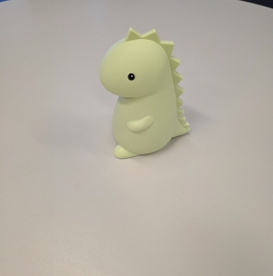

This guide briefly outlines the workflow of scanning an object with Kiri Engine then hosting it on Sketchfab.

## Scanning your object
The free tool that I reccomend to scan objects for use with Sketchfab is called Kiri Engine.  This is a very simple to use app that lets you do basic photogrammatry completely for free.  More importantly, it produces a nice zipped folder with an object file and texture, allowing for the easiest experience uplading your model.

You can find Kiri Engine online at [www.kiriengine.app](https://www.kiriengine.app/) or on your phones app store.

For best results, place your object on a clean flat surface and use the "Auto" option while photographing through the app.  This will have the app detect movement and just take pictures as you move.  It will also let you know if you are moving too fast.

Simply walk around the object while your phone photographs it, trying to do one round with a low angle on the object, one streight on, and on from a high angle to get full coverage of the object.

Once you have 75 to 100 photos, end the session and make sure to have the app creat an .obj file (this should be default).

## Hosting your object
First you will need to download the files from [Kiri Engines Web App](https://www.kiriengine.app/webapp/).  Once you have the .zip folder for your object you are ready to upload it to a model hosting site.

I reccomend hosting your models using Sketchfab as it is free and has an embeddable object viewer.

You will need to make an account at [www.sketchfab.com](https://sketchfab.com/) and then login.

Once you are logged in, click the "Upload" button in the top right and then drag your .zip folder into the upload area.  Fill in any desired metadata and decide if you want others to be able to download your model or not (It will have a CCBY 4.0 license applied by default).

Once your model is hosted its ready to share!  You can also choose to embed the viewer on one of your webpages using the customizable embed code found by clicking the "</>embed" button above the description.

 <iframe title="Dino Toy" frameborder="0" allowfullscreen mozallowfullscreen="true" webkitallowfullscreen="true" allow="autoplay; fullscreen; xr-spatial-tracking" xr-spatial-tracking execution-while-out-of-viewport execution-while-not-rendered web-share width="320" height="320" src="https://sketchfab.com/models/6e48c9b4408742ca8dc5d03bd8379d5c/embed"> </iframe> 

